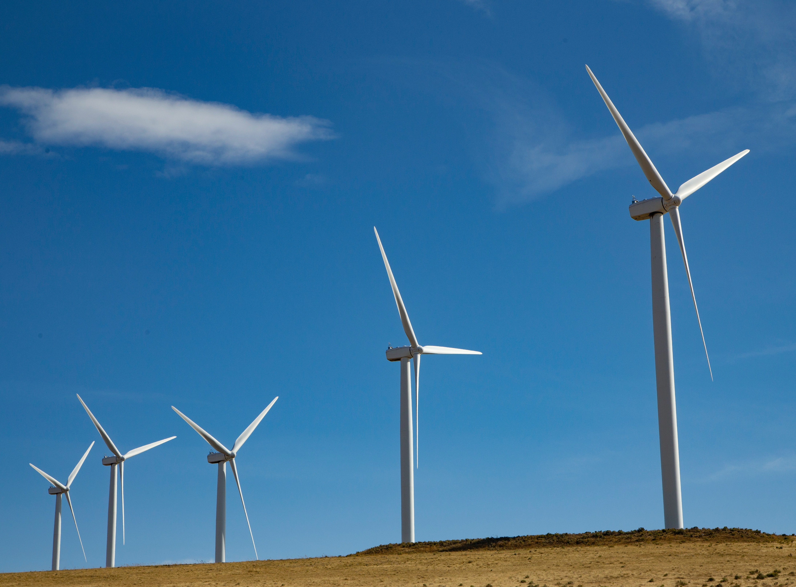
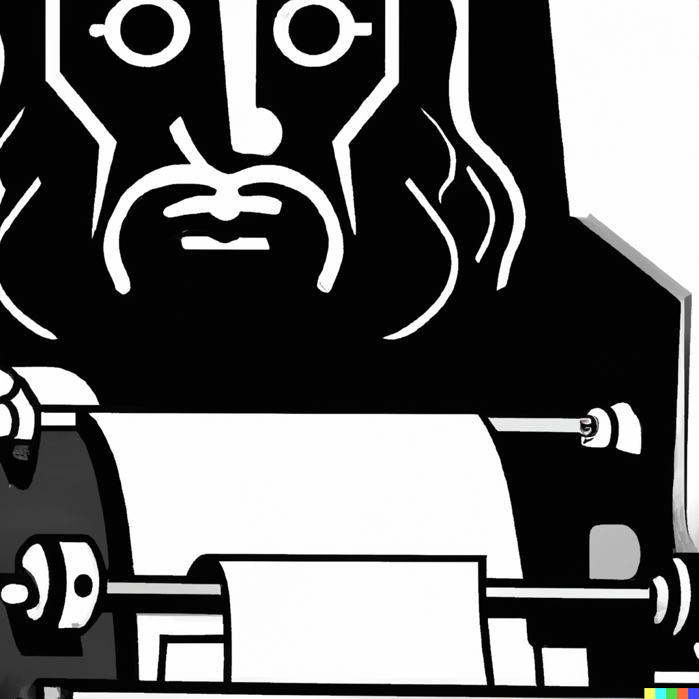

# CLEMENT'S PORTFOLIO

## Data Science projects : 

### [Wind Power Forecasting](https://github.com/Clement7991/Wind_forecasting)

* Guided-project from **DeepLearning.ai** available on [**Coursera**](https://www.coursera.org/learn/ai-and-climate-change?specialization=ai-for-good)
* <ins>Objective :</ins> Predict wind power output at least 24 hours in advance in order to better plan the requirements for other power input sources into the electrical grid.
* <ins>Methodology :</ins> Explored, cleaned and normalized the data (**Pandas**, **Seaborn**, **Matplotlib**...), created a baseline model to then compare with the performance of a Neural Network 
* <ins>Chosen model :</ins> PyTorch RegressorNet (L1 loss + Adam Optimizer)

### [YWL : You Write Like](https://github.com/Clement7991/ywl)

* Group project with [Nico404](https://github.com/Nico404) and [lxmuresan](https://github.com/lxmuresan)
* Created a tool capable of indicating which classic author's style a text resembles.
* Used the Gutenberg API to collect raw texts from 40 different authors.
* <ins>Models tested and gridsearched:</ins> CNN Conv1D, RNN GRU, RNN LSTM, BERT and distilBERT.
* <ins>Chosen model :</ins> Hugging Face's distilBert which had a val accuracy of 0.7.

Watch our [presentation](https://www.youtube.com/watch?v=5VZa8K2afMg&ab_channel=PouetPouet) (only in French...) and try our [app](https://youwritelike.streamlit.app) out!

### [A Titanic Mistake (DS)](https://github.com/Clement7991/Titanic-hw)

* Created an app that can predict the survival of a passenger of the Titanic.
* Used and preprocessed Kaggle's Titanic dataset.
* <ins>Models tested :</ins> Tested a Random Forest Classifier, an Adaboost, a KNN and an ensemble method using all three models.
* <ins>Chosen model :</ins> Chose the Random Forest Classifier, gridsearched parameters and obtained an accuracy of 0.88.

[Check](https://titanic-mistake.streamlit.app/) whether you would have survived. 

## Data Analysis projects : 

### [Energy & CO2 Emissions : A Global Analysis](https://app.powerbi.com/groups/me/reports/c6def853-a898-4400-b343-7679df12a3d7?ctid=dbf392d3-8e2b-4202-b4f9-e05692d171aa&pbi_source=linkShare&bookmarkGuid=c8a365c8-9441-4eea-ae85-15ff9459e103)

* <ins>Objective :</ins> Draw an educational and comparative report on the role power generation plays in each country's CO2 emissions volume and achieve an exploratory analysis of the global state of carbon emissions.
* <ins>Methodology :</ins> collected data from [**Kaggle**](https://www.kaggle.com/datasets/anshtanwar/global-data-on-sustainable-energy), explored and cleaned the data using **Python**, used Powerpoint for design, **HTML** for flag visuals and **PowerBI** to create a dashboard.

Check the [dashboard](https://app.powerbi.com/view?r=eyJrIjoiNjgzMzY0ZDMtZmZiZS00MmVjLWI2ZDEtYzU2NTM2MDdlNDFlIiwidCI6ImRiZjM5MmQzLThlMmItNDIwMi1iNGY5LWUwNTY5MmQxNzFhYSJ9) out!

### [Olist : analysing a Brazilian e-commerce platform](https://olist.com/pt-br/)

* <ins>Objective :</ins> Draw an analytical report of Olist's delay in delivery.
* <ins>Hypothesis :</ins> Delay in delivery has an impact on Olist's churn.
* <ins>Methodology :</ins> collected data from [**Kaggle**](https://www.kaggle.com/datasets/olistbr/brazilian-ecommerce), explored, cleaned the data and feature-engineered using **Python**, used **Tableau** to create a dashboard.
* <ins>Results :</ins> Delay in delivery mostly affects states in the north west of Brazil with low order volumes and has limited impact on customer satisfaction. 
* <ins>Recommendations :</ins> Audit freight services of states with the highest average delay and sellers with recurrent delays in delivery.

Interact with the dashboard [here](https://public.tableau.com/views/Olist_16939080170350/Dashboard1?:language=en-US&:display_count=n&:origin=viz_share_link) !

